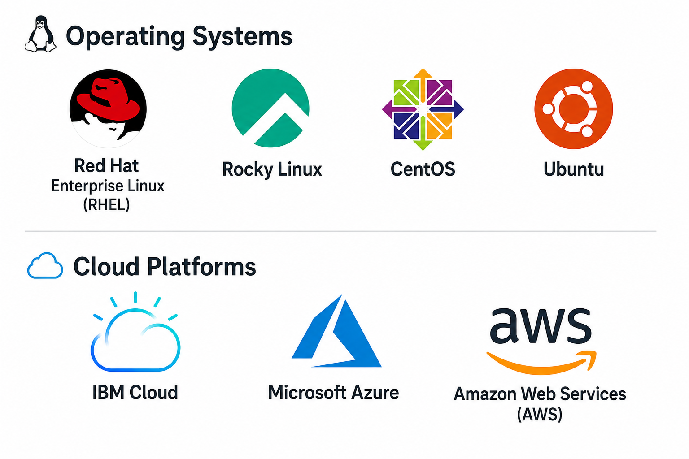

# Hi there 👋, I'm Roshan Munavar

## Portfolio

Experienced Linux Engineer with 10+ years of expertise in Linux Administration, Cloud Infrastructure, Production Support, Automation, DevOps practices, and Bare Metal deployments. Passionate about building reliable infrastructure, automating repetitive tasks, and continuously learning new technologies.

---

## Skills

  

### Operating Systems
- Red Hat Enterprise Linux (RHEL)
- Rocky Linux
- CentOS
- Ubuntu

### Cloud Platforms
- IBM Cloud
- Microsoft Azure
- Amazon Web Services (AWS)

### Configuration Management & Automation
- Ansible
- Chef
- Bash Shell Scripting

### DevOps & CI/CD
- Jenkins
- TeamCity
- CruiseControl
- Git
- GitHub
- Bitbucket

### Linux Administration
- LVM
- NFS & AutoFS
- SSH
- DNS
- TCP/IP Networking
- RAID Configuration
- Package Management
- Systemd
- Performance Tuning
- Incident & Change Management

### Virtualization
- VMware vSphere
- Citrix XenServer
- Bare Metal Server Deployment

### Monitoring & Logging
- Nagios
- Splunk
- SolarWinds
- Graylog
- New Relic

### Web & Database
- Apache
- Nginx
- Tomcat
- MySQL

---

## Experience

### **Linux Engineer**
### SNEX Technology Services Pvt. Ltd.
**Jan 2024 – Present**

- Linux Administration and Production Support
- Azure VM deployment using Ansible
- Vulnerability Management & Patch Management
- Bare Metal and VMware Host Deployment
- Shell Script Automation
- Incident & Change Management
- On-call Production Support

---

### **Senior System Engineer**
### IBM Cloud (via Abacus Staffing & Services)
**Oct 2020 – Nov 2023**

- IBM Cloud Infrastructure Operations
- Bare Metal & VM Provisioning
- Kickstart Automated Deployments
- Chef & Ansible Configuration Management
- Linux Migrations (CentOS to RHEL)
- DNS, RAID, Network and Storage Administration
- Hardware Lifecycle Management
- L3/L4 Production Support

---

### **Lead Product Development**
### Harman Connected Services
**Aug 2019 – Nov 2019**

- AWS Infrastructure
- SSL & Certificate Management
- Apache & Tomcat Administration
- Infrastructure Automation
- CloudFormation
- Python & Bash Automation

---

### **System Engineer**
### Time Inc.
**Jan 2015 – Jul 2016**

- Linux Server Administration
- Apache & MySQL Administration
- DNS Management
- AWS Migration
- Package Management & Security Patching

---

### **Deployment / Linux System Engineer**
### Sigma Infosolutions Ltd.
**Mar 2011 – Jan 2015**

- Linux Server Deployment
- Apache, Tomcat & MySQL Administration
- Nagios Monitoring
- NFS, Samba & FTP Configuration
- Shell Scripting
- SSL Implementation

---

## Education

**Bachelor of Engineering (B.E.)**
Electronics & Communication Engineering

Jayam College of Engineering & Technology

---

## Interests

- Linux System Administration
- Cloud Computing
- Infrastructure Automation
- DevOps & Open Source Technologies
- Learning New Technologies
- Surfing Technical Blogs & Documentation
- Solving Real-world Infrastructure Challenges
- Spending Quality Time with Family

---

## Certifications

- RHCSA
- RHCE
- IBM Certified Professional Architect
- IBM Certified Technical Advocate
- IBM Certified Advocate
- IBM Certified Advocate Plus
- IBM Certified Professional Architect
- IBM Certified Advanced Architect
- IBM Cloud DevSecOps v1 Specialty
- IBM Certified Associate SRE
- IBM Certified Professional SRE
- IBM Certified Professional SRE PLUS IBM Cloud for DevSecOps
- IBM Cloud for VMware Specialty
  And
- Active subscriber on “A Cloud Guru (@Pluralsite)”

---

> *"Keep learning, automate everything possible, and build reliable infrastructure."*
